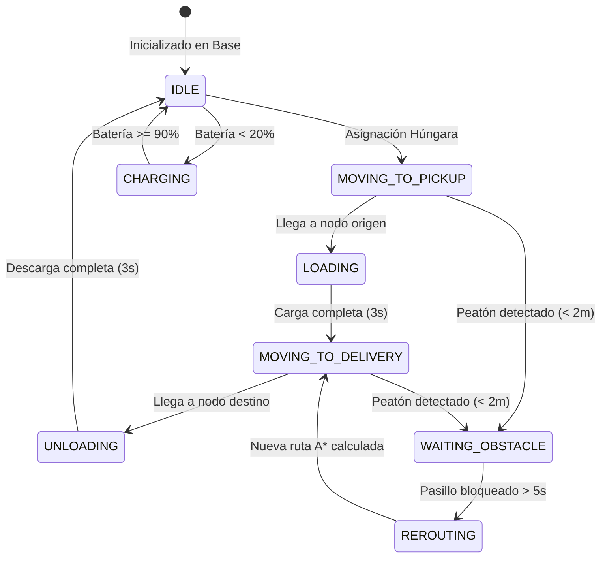
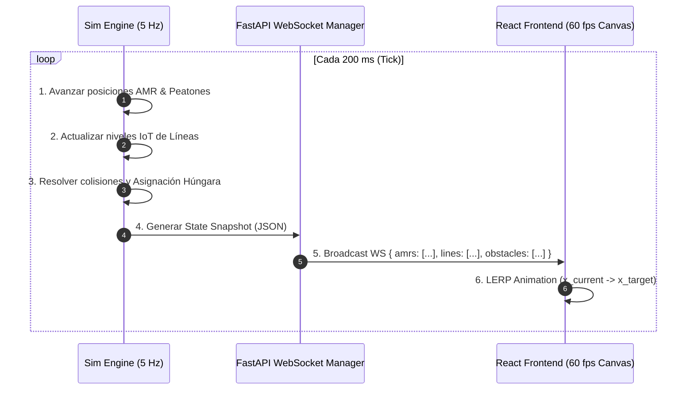

# Simulación Intralogística en Tiempo Real para NestLink (Reto 1)
**Guía de Arquitectura, Comparativa de Motores y Diseño de Simulación (FastAPI + React)**

> **Objetivo:** Diseñar e implementar el motor de simulación intralogística para NestLink, orquestando una flota de 4 a 6 AMRs, líneas de producción y empacado, peatones y bloqueos dinámicos, garantizando una visualización fluida y una demo 100% determinista en el hackathon (10 horas de desarrollo, 2 desarrolladores).

---

## 1. Comparativa de Enfoques de Simulación

Para construir un gemelo/simulador intralogístico en una jornada intensiva, evaluamos cuatro enfoques arquitectónicos:

| Criterio | Enfoque A: **SimPy** (Discrete-Event Simulation) | Enfoque B: **Loop por Ticks Asíncronos** (`asyncio` Fixed Delta-t) | Enfoque C: **Mesa** (Agent-Based Modeling) | Enfoque D: **Híbrido** (Planificador Discreto + Interpolador Front) |
| :--- | :--- | :--- | :--- | :--- |
| **Naturaleza del Reloj** | Reloj de eventos discretos (`env.now`). Salta instantáneamente al siguiente evento. | Reloj de pared sincronizado (`wall-clock`). Ticks constantes (ej. 5 Hz / 200ms). | Ticks discretos por paso (`model.step()`). | Discreto para misiones + Ticks continuos para cinemática. |
| **Facilidad para UI en Tiempo Real** | **Media/Baja:** Requiere `simpy.rt.RealtimeEnvironment` o step manual para no congelar o desincronizar con WebSockets. | **Muy Alta:** Cada tick emite naturalmente el estado exacto al WebSocket o buffer de polling. | **Media:** Requiere adaptar el scheduler de Mesa con FastAPI. | **Alta:** El backend emite puntos de ruta y el front interpola con Framer Motion / Canvas. |
| **Modelado de Peatones y Bloqueos** | **Complejo:** SimPy modela recursos y colas; mover un obstáculo continuo requiere generar eventos artificiales de micro-pasos. | **Muy Sencillo:** En cada tick se actualiza `(x, y)` del peatón y se valida intersección con aristas de NetworkX. | **Sencillo:** Trae soporte de grid 2D, pero con sobrecarga innecesaria. | **Muy Sencillo:** Bloqueos disparan evento de invalidación y recálculo A*. |
| **Curva y Riesgo en 1 Día (10 hrs)** | Riesgo de bloqueo en el event loop de asyncio; debugging de generadores `yield`. | **Riesgo Mínimo:** Código Python puro con `asyncio.sleep()`, fácil de entender y depurar. | Riesgo Medio: Librería pesada con boilerplate. | Riesgo Bajo: Separación limpia de responsabilidades. |
| **Rendimiento / Overhead** | Extremadamente ligero, pero desacoplado del render visual. | Muy ligero (4-6 AMRs y 20 nodos consumen < 1% CPU). | Mayor consumo por abstracciones de agentes. | Óptimo: mínimo tráfico de red. |

---

### Recomendación Final y Justificación Técnica: **Enfoque B Mejorado (Loop por Ticks Asíncronos con NetworkX)**

> 🏆 **Veredicto:** Para el hackathon, **NO recomendamos SimPy puro** para la cinemática en vivo de los AMRs, sino un **Motor de Ticks Asíncrono (`AsyncioTickEngine`) a 2-5 Hz** respaldado por **NetworkX** para el grafo de planta y **Scipy** para la asignación húngara.

#### ¿Por qué descartar SimPy puro para la demo en vivo?
1. **La naturaleza de SimPy es saltar en el tiempo:** En SimPy, si un AMR viaja de la Línea 1 al Almacén (demora 30 segundos), SimPy ejecuta `yield env.timeout(30)` y el reloj salta de `t=0` a `t=30` en **0.001 milisegundos de CPU**. Para que la audiencia vea al robot desplazándose suavemente por el pasillo en la pantalla, tendrías que romper el viaje en 300 eventos de 0.1s, perdiendo la ventaja formal de eventos discretos y transformándolo en un ticker manual.
2. **Fricción con `asyncio` y WebSockets:** SimPy es sincrónico basado en generadores clásicos de Python (`yield`). Correrlo junto al loop asíncrono de FastAPI sin bloquear el servidor web añade complejidad innecesaria en un entorno de 10 horas.
3. **Manejo dinámico de peatones y bloqueos:** Detectar colisiones y recalcular rutas A* cuando una persona cruza un pasillo se resuelve de manera trivial y determinista en un tick loop (`if amr.distance_to(person) < threshold: stop_and_reroute()`).

---

## 2. Modelado Concreto de la Planta con NetworkX y Agentes

### 2.1. Topología de la Planta como Grafo (`networkx.DiGraph`)
La planta de Nestlé se modela como un grafo dirigido ponderado donde:
* **Nodos:** Representan puntos clave en el plano 2D con coordenadas `(x, y)`:
  - `L1_OUT`, `L2_OUT`, `L3_OUT`: Bahías de salida de Producto Terminado (PT).
  - `E1_IN`, `E2_IN`, `E3_IN`: Bahías de entrada de insumos a Empacadoras (bobinas, corrugados).
  - `WH_IN_1`, `WH_IN_2`: Bahías de recepción en Almacén Central.
  - `WH_OUT_1`, `WH_OUT_2`: Bahías de despacho de insumos en Almacén.
  - `CHARGER_1` .. `CHARGER_4`: Estaciones de carga inductiva.
  - `X_01` .. `X_12`: Puntos de cruce e intersecciones en pasillos principales.
* **Aristas:** Representan pasillos transitables con atributos:
  - `length`: Distancia euclidiana o real en metros.
  - `max_speed`: Velocidad permitida (ej. 1.5 m/s en rectas, 0.8 m/s en cruces).
  - `direction`: Unidireccional o bidireccional (evita colisiones frontales en pasillos estrechos).
  - `blocked`: Booleano para inhabilitar temporalmente la arista si hay un derrame o pallet mal colocado.

```
 [Línea 1 (PT)] ──(X_01)────────(X_02)────────(X_03)── [Almacén Central]
       │            │              │              │            │
 [Línea 2 (PT)] ──(X_04)────────(X_05)────────(X_06)── [Bahía Carga]
       │            │              │              │            │
 [Empacadora 1] ──(X_07)────────(X_08)────────(X_09)── [Despacho Insumos]
```

### 2.2. AMRs como Agentes de Estado Finito (FSM)
Cada AMR tiene un ciclo de vida modelado como una máquina de estados:



### 2.3. Generador de Consumo IoT y Demanda de Líneas
* **Telemetría de Empacadoras:** Cada empacadora consume insumos (film plástico para galletas, cajas de café) a una tasa configurable (ej. 1 bobina cada 8 minutos simulados).
* **Sensor IoT de Nivel:** Un sensor de nivel emite porcentaje restante `0% - 100%`.
* **Disparo Automático de Tarea JIT:** Cuando el buffer de material baja de **25%** (umbral crítico), el simulador inyecta automáticamente una tarea `SUPPLY_REQUEST` a la cola de misiones sin intervención humana.
* **Salida de Producto Terminado:** Cada línea llena un pallet de PT cada $N$ minutos; al llegar a 100%, se dispara `PICKUP_PT_REQUEST`.

### 2.4. Peatones Móviles y Bloqueos Dinámicos
* **Peatones (Zonas de Peligro):** Se configuran 2 operarios simulados (`PERSON_1`, `PERSON_2`) que recorren rutas de patrulla o cruzan pasillos peatonales a 1.0 m/s.
  - Alrededor de cada persona existe un radio de seguridad de **2.5 metros**.
  - Si un AMR entra en ese radio:
    1. Si la persona está en movimiento y cruzará rápido: el AMR frena (*Estado: `SLOW_DOWN` o `WAITING`*).
    2. Si la persona se detiene en el nodo/pasillo: el AMR invoca recálculo dinámico con A*.
* **Bloqueos Dinámicos (Incidentes Forzados para la Demo):**
  - Evento disparable desde la UI con un clic (*"Simular derrame en Pasillo Central X_02 ↔ X_05"*).
  - El backend marca la arista como `blocked = True` y peso $\infty$.
  - Todos los AMRs que tenían esa arista en su path recalculan su ruta A* en el siguiente tick, visualizándose el desvío en tiempo real en la pantalla.

---

## 3. Puente con el Frontend en Tiempo Real (FastAPI + WebSockets)

### 3.1. El Reto de Sincronización y la Solución Elegida
Para lograr animaciones a 60 fps en React sin saturar el canal WebSocket ni sobrecargar el backend de Python:

> 🎯 **Patrón Recomendado: "State-Tick Broadcast + Client-Side Interpolation"**
> * El Backend corre a **5 Hz (1 tick cada 200 ms)** y emite un snapshot liviano de estado JSON.
> * El Frontend recibe las coordenadas `(x, y)` actuales y meta de cada AMR y realiza **interpolación lineal continua (LERP)** en el Canvas / SVG a 60 fps.



### 3.2. Payload JSON del Snapshot de Simulación
```json
{
  "sim_time": 142.6,
  "tick_id": 713,
  "amrs": [
    {
      "id": "AMR-01",
      "name": "Nescafé Shuttle",
      "state": "MOVING_TO_DELIVERY",
      "x": 340.5,
      "y": 180.2,
      "target_node": "E1_IN",
      "battery": 87,
      "current_payload": "BOBINA_FILM_200M",
      "path": ["X_05", "X_08", "E1_IN"]
    },
    {
      "id": "AMR-02",
      "name": "Savoy Express",
      "state": "WAITING_OBSTACLE",
      "x": 120.0,
      "y": 250.0,
      "target_node": "WH_IN_1",
      "battery": 64,
      "current_payload": "PALLET_CHOCOLATE",
      "path": ["X_04", "X_01", "WH_IN_1"]
    }
  ],
  "lines": [
    {"id": "L1", "name": "Línea Nescafé", "pt_ready_pct": 78, "status": "OPERATIONAL"},
    {"id": "E1", "name": "Empacadora Savoy", "material_buffer_pct": 22, "status": "WARNING_LOW_STOCK"}
  ],
  "obstacles": [
    {"id": "PERSON_1", "type": "OPERATOR", "x": 125.0, "y": 248.0, "radius": 2.5},
    {"id": "BLOCK_01", "type": "SPILL", "node_a": "X_02", "node_b": "X_05", "active": true}
  ],
  "kpis": {
    "trips_completed": 18,
    "empty_trips_prevented": 6,
    "line_stoppages_prevented": 2,
    "avg_delivery_time_sec": 42.5
  }
}
```

---

## 4. Diseño de Módulos del Simulador (`sim/`)

Estructura de archivos limpia y modular para el repositorio del Backend:

```
backend/
├── main.py                 # Entrada FastAPI + Endpoints REST + WS Endpoint
├── core/
│   ├── config.py           # Constantes (velocidades, semillas, factores)
│   └── Hungarian.py        # Asignador óptimo scipy.optimize.linear_sum_assignment
└── sim/
    ├── __init__.py
    ├── env.py              # Bucle maestro de simulación (Tick Engine)
    ├── map_graph.py        # Grafo de la planta (NetworkX) y rutas A*
    ├── agents.py           # Clase AMR y FSM de comportamiento
    ├── generators.py       # Simulación de consumo/producción de líneas
    ├── obstacles.py        # Lógica de peatones y bloqueos de pasillos
    └── bridge.py           # Gestor de conexiones WebSockets y serialización
```

### 4.1. Responsabilidades de Cada Módulo

#### 1. `sim/map_graph.py`
* Carga los nodos y aristas de la planta desde un diccionario de configuración.
* Expone `get_shortest_path(start_node, target_node, blocked_edges=[])` usando `networkx.astar_path()`.
* Calcula puntos intermedios `(x, y)` sobre las aristas para el avance continuo.

#### 2. `sim/agents.py` (`AMRAgent`)
* Mantiene posición continua `(x, y)`, velocidad actual, nivel de batería y carga.
* Método `step(dt, obstacles)`:
  - Avanza en la trayectoria calculada una distancia $d = v \cdot dt$.
  - Chequea proximidad con peatones; si hay invasión de zona de seguridad, transiciona a `WAITING`.
  - Si un segmento está bloqueado, solicita nuevo cálculo de ruta al `map_graph`.

#### 3. `sim/generators.py` (`PlantDemandGenerator`)
* Simula la degradación del stock de bobinas y el llenado de pallets terminados.
* Registra y encola solicitudes en `MissionQueue` con prioridades dinámicas (ej. Prioridad 10 para línea a punto de detenerse vs Prioridad 2 para traslado rutinario).

#### 4. `sim/obstacles.py` (`ObstacleManager`)
* Administra la lista de peatones y bloqueos.
* Mueve a los peatones en bucles de patrulla (*Waypoints: W1 → W2 → W3 → W1*).
* Expone métodos `toggle_block(edge_id)` para interactuar con los botones de la demo en vivo.

#### 5. `sim/env.py` (`SimulationEnvironment`)
* Orquesta el loop principal en una corrutina de `asyncio`:
```python
async def run_simulation_loop():
    while True:
        # 1. Actualizar líneas y generar demandas
        generators.update(DT)
        
        # 2. Asignación óptima de misiones (Húngaro) a AMRs libres
        dispatcher.assign_pending_missions(amrs, mission_queue)
        
        # 3. Mover peatones
        obstacles.update(DT)
        
        # 4. Mover AMRs y gestionar colisiones
        for amr in amrs:
            amr.step(DT, obstacles.get_active_obstacles())
            
        # 5. Emitir snapshot por WebSocket
        await bridge.broadcast_state(build_snapshot())
        
        # 6. Esperar el tick real
        await asyncio.sleep(TICK_INTERVAL_SEC) # 0.2s = 5 Hz
```

---

## 5. Gotchas, Buenas Prácticas y Estrategia Anti-Fallo

### 5.1. Factor de Aceleración Temporal (`SIM_SPEED_FACTOR`)
* En una planta real, un AMR tarda 2 a 3 minutos en cruzar un almacén grande. En un pitch de 5 minutos, esto haría que la demo sea aburrida y lenta.
* **Regla de Oro:** Configurar `SIM_SPEED_FACTOR = 4.0` o `5.0`.
  - Un recorrido completo toma **12 a 18 segundos reales**.
  - Los indicadores de consumo bajan visiblemente en 1 minuto.
  - La audiencia y el jurado pueden ver 3 ciclos completos de asignación y despacho durante el pitch.

### 5.2. No Bloquear el Event Loop de FastAPI
* **Regla:** Ningún cálculo dentro del step debe ser bloqueante. `networkx.astar_path` sobre 30 nodos toma menos de **0.1 ms**, y la asignación húngara de Scipy para matriz 6x10 toma menos de **0.2 ms**.
* El bucle debe ejecutarse mediante `asyncio.create_task(sim_env.run_simulation_loop())` en el hook `lifespan` o `@app.on_event("startup")` de FastAPI.

### 5.3. Reproducibilidad y Semilla Fija (`random.seed(42)`)
* Para los ensayos del pitch, fijar `random.seed(42)` y `numpy.random.seed(42)`.
* Esto garantiza que los eventos ocurran en el **mismo segundo exacto**:
  - A los 30 segundos: La Empacadora 1 entra en advertencia amarilla.
  - Al minuto 1:15: El AMR-02 es asignado a la misión.
  - Al minuto 2:00: El peatón cruza el pasillo y el AMR-02 frena y se desvía.
  - Al minuto 2:30: El jurado ve en pantalla la resolución exitosa.

### 5.4. Estrategia de Fallback Estático (Cero Riesgo de "Demo Effect")
Si por cualquier motivo de red local en la USFQ se corta la conexión entre el frontend y el backend:
1. **Modo Offline en React:** Incluir en el frontend un archivo `mock_trajectory_data.json` que reproduce la simulación idéntica localmente en el navegador usando un `setInterval` interno.
2. **Toggle Oculto / Hotkey:** Presionar `Ctrl + Shift + D` o un switch discreto en la barra superior para alternar entre `Backend: Live WS` y `Frontend: Standalone Simulation`.

---

## Resumen Ejecutivo de Decisiones Técnicas

1. **Motor:** *Asyncio Ticking Engine* a 5 Hz en Python/FastAPI (sin la sobrecarga ni desfase de SimPy).
2. **Topología y Ruteo:** Grafo dirigido con *NetworkX* + algoritmo $A^*$ dinámico con penalización de obstáculos.
3. **Optimización:** Método Húngaro (*Scipy Linear Sum Assignment*) para asignación global óptima AMR-Misión.
4. **Visualización:** *Canvas 2D / SVG interactivo* en Next.js con interpolación LERP a 60 fps y semáforo de estados.
5. **Seguridad en Demo:** Factor de velocidad 4x, semilla pseudoaleatoria fija (`seed=42`) y fallback offline en cliente.
